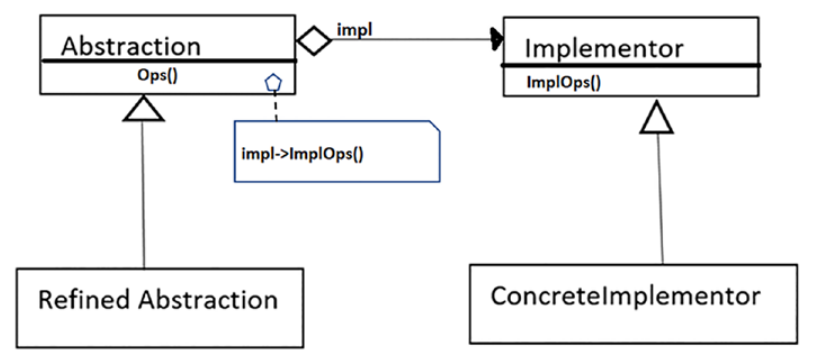

## Bridge Pattern

#### Определение GoF
Отделяет абстракцию от ее имплементации так что они могут изменяться независимо
друг от друга.

#### Концепция
Этот шаблон также известен как Handle/Body pattern. Используя его вы отделяете имплементирующий
класс от абстрактного класса предоставляя Мост между ними.  
Вы можете структурно изменять одни классы не влияя на другие классы.

#### Пример
В компании разрабатывающей софт, команда разработки и команда маркетинга обе играю важную роль.
Обычно маркетинг исследует рынок и собирает предпочтения пользователей. Разработчики реализуют эти
требования, чтобы удовлетворить потребности клиентов. Любое изменение в одной команде не должно оказывать
прямого влияния на другую команду. Можно рассматривать команду маркетинга как Мост между клиентами продукта
и командой разработки.

#### Примеры из разработки
GUI фреймворки могут использовать Мост для отделения абстракции от реализаций специфичных для
конкретных платформ. Например для Linux или macOS.  
В Java используется JDBC, которая предоставляет Мост между вашим приложением и конкретной базой
данных. Например класс _java.sql.DriverManager_ и интерфейс _java.sql.Driver_ формируют Мост, где
первый играет роль абстракции, а второй играет роль интерфейса для имплементации. Есть много
конкретных имплементаций, таких как _com.mysql.cj.jdbc.Driver_ и _oracle.jdbc.driver.OracleDriver_. 

#### Классический шаблон Мост

* _Abstraction_ определяет абстрактный интерфейс и содержит ссылку на _Implementor_.
Слово "abstraction" используется здесь для обозначения методов понижающих сложность. 
Эти методы скрывают внутренние детали своей работы от клиентского кода.
* _Implementor_ определяет интерфейс для имплементирующих классов. Его методы не обязаны
точно соответствовать методам абстракции. Обычно они включают низко-уровневые простые операции,
а _Abstraction_ определяет операции более высокого уровня основываясь на этих простых операциях.

[Local Code Example](../src/main/java/learn/dp/jdpexamples/c14bridge)
