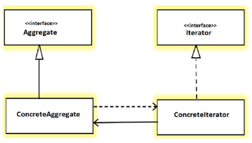

## Iterator Pattern

#### Определение GoF
Предоставляет способ последовательного доступа к элементам агрегирующего объекта
без раскрытия его внутреннего представления.

#### Концепция
Итераторы обычно используются для обхода контейнеров (коллекций объектов) для доступа элементов
без знания о том как данные хранятся внутри контейнера. Когда вам нужно обойти коллекции различного
типа, то очень полезно иметь для этого стандартный и унифицированный способ.

Участники шаблона:
* _Iterator_: интерфейс используемый для доступа и обхода элементов
* _ConcreteIterator_: реализует методы интерфейса _Iterator_ и может хранить текущую позицию
внутри обходимой коллекции
* _Aggregate_: определяет интерфейс, который может создавать объект _Iterator_
* _ConcreteAggregate_: реализует интерфейс _Aggregate_ и возвращает экземпляр _ConcreteIterator_

Также важно:
* Этот шаблон часто используется для обхода узлов древообразных структур. Поэтому во многих
примерах Итератор используется вместе с шаблоном Компоновщик (Composite).
* Роль Итератора не ограничивается обходом, она может варьироваться для поддержания
различных требований. Например вы можете фильтровать элементы разными способами.
* Клиенты не могут видеть внутренний механизм обхода. Клиентский код только использует
public методы Итератора.

#### Пример
Есть компания А и компания Б. Компания А хранит записи о сотрудниках в связном списке, 
а компания Б хранит такие данные в массиве. Однажды обе компании сливаются в одну более крупную
организацию. Шаблон Итератор полезен в такой ситуации, когда вам не нужно писать код с нуля.
В подобной ситуации у вам может быть общий интерфейс для доступа к данным обеих компаний.    
Другой пример. Ваша компания решила продвигать сотрудников по службе основываясь на их производительности. 
Менеджеры собираются вместе и устанавливают общий критерий оценки. Затем они итерируют по записям
сотрудников, чтобы отметить потенциальных кандидатов для продвижения.

#### Примеры из разработки
* _java.util.Iterator_ and _java.util.Enumeration_
* _java.util.Scanner_ implements _Iterator<String>_

[Local Code Example](../src/main/java/learn/dp/jdpexamples/c18iterator)
