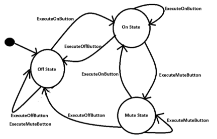

## State Pattern

#### Определение GoF
Позволяет объекту менять свое поведение когда изменяется его внутреннее состояние.
Внешне это выглядит так что объект поменял свой класс.

#### Концепция
Определение GoF легко понять. Оно утверждает, что объект может менять свое поведение и это
зависит от его текущего состояния.  
Предположим у вас большое приложение кодовая база которого быстро растет. Как результат,
ситуация усложняется и вам может понадобится множество if-else и switch конструкций, чтобы 
задать разнообразные условия. Шаблон Состояние подходит к такой ситуации. Он позволяет вашим
объектам вести себя по-разному, в зависимости от их текущего состояния, и вы можете определить
поведения специфичные для разных состояний.  
В этом шаблоне начните мыслить в терминах возможных состояний вашего приложения и разделите
код соответственно. В идеале, каждое состояние независимо от других состояний. Вы отслеживаете
эти состояния, и ваш код отвечает поведением текущего состояния. Например, вы смотрите телевизор.
Если вы нажмете кнопку Mute, то замените изменение состояния вашего телевизора. Но вы не 
увидите изменений, если телевизор выключен.  
Основная идея в том, что если ваш код может отследить текущее состояние приложения, то вы
можете централизировать задачу, разделить ваш код и реагировать соответственно. Поэтому
далее вы увидите поведение специфичное для различных состояний в отдельных классах.
Это ключевая концепция в шаблоне Состояние.

#### Пример
Вы можете переключать каналы телевизора если он во включенном состоянии и не можете
переключать, если он в выключенном состоянии.

#### Примеры из разработки
* Сетевое соединение, например TCP. Объект может быть в различных состояниях. Например соединение может быть
уже установлено, соединение может быть закрыто, или объект начал слушать соединение. Когда соединение получает
запрос от других объектов, оно отвечает в соответствии с его текущим состоянием.
* Система обработки заданий может обрабатывать определенное кол-во заданий в единицу времени. Когда появляется
новое задание, то либо система обрабатывает задание, либо сигнализирует что она занята максимальным кол-во
заданий, которое может обрабатывать в этот момент. Этот сигнал показывает, что возможности по обработке заданий
исчерпаны и новый запрос на обработку не может быть выполнен немедленно.

[Local Code Example](../src/main/java/learn/dp/jdpexamples/c22state)
 

