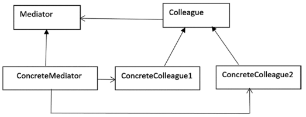

## Mediator Pattern

#### Определение GoF
Определяет объект, который инкапсулирует взаимодействие группы объектов. Шаблон Посредник
способствует слабой связанности предотвращая объекты от явного обращения друг к другу,
и также позволяет независимо варьировать их взаимодействие.

#### Концепция
Посредник используется объектами для взаимодействия друг с другом. Он берет на себя
ответственность за контроль и координацию взаимодействия определенной группы объектов, 
которые не хранят прямых ссылок друг на друга. В результате вы снижаете количество
прямых взаимодействий и понижаете сопряженность (coupling) между ними в вашем приложении.

#### Пример
Когда взлетает самолет, то производится серия проверок. Эти проверки должны подтвердить
что все части и компоненты (зависящие друг от друга) находятся в отличном состоянии.  
Когда пилоты разных самолетов в зоне аэропорта коммуницируют с диспетчерами, то они
не коммуницируют с пилотами других самолетов. Они отправляют свой статус диспетчерской.
Диспетчерская шлет сигналы подтверждающие разрешение на взлет или посадку. Диспетчерская
не контролирует весь полет, а лишь накладывает ограничения в зоне конкретного аэропорта.

#### Пример из разработки
Когда клиент работает с бизнес-приложением, то оно реализует некоторые ограничения.
Например форма для ввода логина и пароля для доступа к аккаунту может также включать
дополнительные обязательные поля для ввода e-mail, почтового адреса, возраста и т.п.  
Первоначально вы проверяете, что логин или ID пользователя корректный (valid), если
он корректный, тогда только поле для ввода пароля активируется. После ввода обоих значений
вы можете проверить введен ли e-mail. Если все это введено в правильном формате, то 
активируется кнопка Отправить (Submit). Шаблон Посредник полезен для такого сценария.  
Когда программа состоит из многих классов и логика распределена по ним, то код трудно
читать и поддерживать. В таких сценариях, если вы хотите внести изменения в поведение
системы, это может быть трудновыполнимо, если вы не использует шаблон Посредник.  
Примеры из JDK:
* метод _execute()_ интерфейса _java.util.concurrent.Executor_ следует этому шаблону.
* класс _javax.swing.ButtonGroup_ имеет метод _setSelected()_ который ensures что
пользователь может provide a new selection.
* различные перегруженные версии метода _schedule()_ класса _java.util.Timer_ также
следует этому шаблону.

В примере шаблона Посредник участвуют:
* _Mediator_: определяет интерфейс осуществляющий коммуникацию
между объектами _Colleague_.
* _ConcreteMediator_: поддерживает список объектов _Colleague_, 
координирует коммуникацию между объектами _Colleague_.
* _Colleague_: интерфейс для коммуникации с другими коллегами.
* _ConcreteColleague_: объекты коммуницирующие друг с другом через
_Mediator_.

[Local Code Example](../src/main/java/learn/dp/jdpexamples/c23mediator) 
