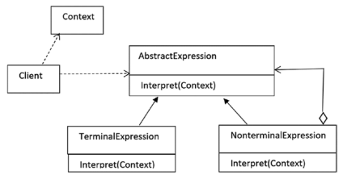

## Interpreter Pattern

#### Определение GoF
Определяет представление для грамматики языка вместе с интерпретатором, который использует
это представление, чтобы интерпретировать предложение языка.

#### Концепция
Этот шаблон играет роль транслятора и часто используется, чтобы транслировать предложения языка.
Прежде всего должна быть определена грамматика представляющая язык. Затем интерпретатор работает
с этой грамматикой. Шаблон работает лучше всего если грамматика простая.

Каждый класс в этом шаблоне представляет правило в языке и должен иметь метод для интерпретации
выражения. Чтобы обработать большее количество правил, вы создаете большее количество 
классов, и по этой причине шаблон Интерпретатор редко используется что обработки очень
сложных грамматик.

Участники шаблона:
* _AbstractExpression_: интерфейс содержащий метод _interpret_ принимающий объект context.
* _TerminalExpression_: используется для терминальных выражений, которым не нужды другие
выражения для интерпретации. Обычно это узлы-листья (то есть не имеющие дочерних узлов).
* _NonterminalExpression_: используется для нетерминальных выражений. Также обозначается как
_AlternationExpression_, _RepetitionExpression_, или _SequenceExpression_. Они подобны композитам
содержащим и терминальные, и нетерминальные выражения. Когда вы вызываете на нем метод
_interpret_, вы вызываете методы _interpret_ всех его дочерних узлов.
* _Context_: содержит глобальную информацию нужную интерпретатору.
* _Client_: вызывает метод _interpret()_ и может также строить синтаксическое дерево основанное
на правилах языка.

#### Пример
Переводчик переводящий иностранный язык. Также можно рассмотреть музыкальные ноты как грамматику,
а играющих музыкантов как интерпретаторов.

#### Пример из разработки
Компилятор Java интерпретирует исходный код Java в байт-код понимаемый JVM.
Пример из JDK:
* абстрактный класс _java.util.Format_ используется для форматирования информации зависящей
от локали, такой как даты, сообщения, числа. Его под-классы используют шаблон Интерпретатор.

[Local Code Example](../src/main/java/learn/dp/jdpexamples/c25interpreter)
