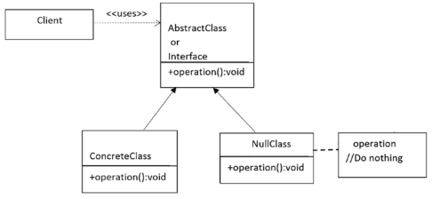

## Null Object Pattern

#### Определение
Null Object это объект не имеющий ссылки на значение либо обладающий нейтральным поведением.
Шаблон Null Object описывает использование такого объекта и его поведение (или отсутствие поведения).

#### Концепция
Шаблон может реализовать поведение, которое на самом деле не выполняет никаких действий, либо может
предоставить поведение по умолчанию, когда приложение имеет дело с отсутствующим объектом (null reference)
вместо реального объекта. Главная цель использования этого шаблона в том, чтобы предоставить лучшее
решение чем "проверка на null". Обычно вы инкапсулируете отсутствие объекта предоставляя вместо него
поведение, которое не делает ничего.

#### Пример
Стиральная машина выполняет свою функцию стирки если было добавлено достаточно воды. Но предположим, что
вы забыли налить воду перед началом стирки, и нажали кнопку начинающую процесс стирки. Стиральная машина
не должна получить из-за этого повреждения, поэтому в такой ситуации она подаст звуковой сигнал, чтобы
напомнить что в ней нет воды для стирки.

#### Пример из разработки
Сервер выполняет калькуляцию основываясь на вводе от клиента. При этом сервер должен избегать выполнения
ненужных или заведомо невыполнимых калькуляций. Поэтому должна производиться проверка корректности ввода
клиента, чтобы, в случае некорректного ввода, проигнорировать его.  
В JDK можно увидеть множество адаптеров в пакете _java.awt.event_. Например абстрактный класс _MouseMotionAdapter_
содержит методы с пустым телом такие как _mouseDragged(MouseEvent e) {}_.

[Local Code Example](../src/main/java/learn/dp/jdpexamples/c26nullobject)
